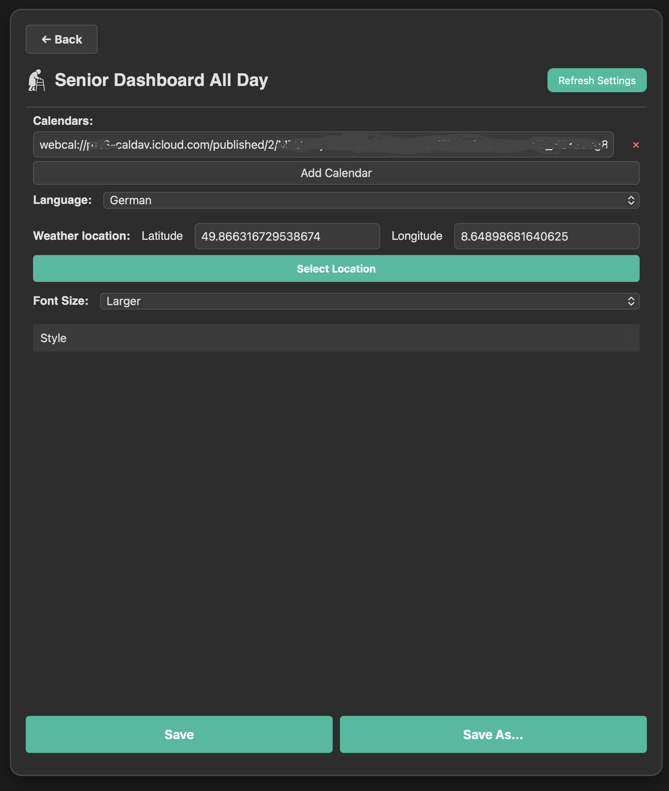
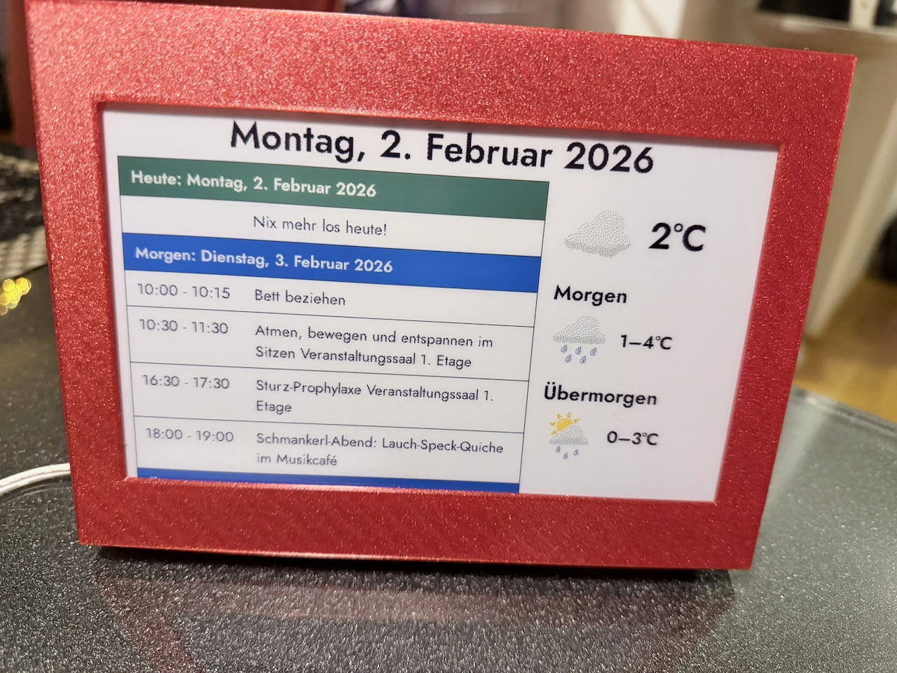

# InkyPi-Plugin-seniorDashboard_allDay

*InkyPi-Plugin-seniorDashboard_allDay* is a plugin for [InkyPi](https://github.com/fatihak/InkyPi) that shows a simple, at-a-glance view of the next few days: a calendar list and a small weather block. It is intended for an elderly person who has a calendar maintained for them by a family member or carer.

**What it does:**

- **Calendar** — Displays today and the next two of days in a list. Events that have already ended are hidden. 
- **Weather** — Shows current conditions and a short forecast (e.g. tomorrow and the day after) in a minimal layout: icon and temperature, with high/low for the next days.
It uses the DWD (Deutscher Wetter Dienst) free API, so no API-key config needed.

The layout is kept clear and low-clutter so it works well on an e-ink display and for quick, easy reading.

It is optimized for and tested only on landscape waveshare 7.2 inch display but should render ok on every comparable landscape display.

It's basically a mix of the calendar list view and weather template.
No additional dependencies whatsoever.

**Settings:**

Language can be set to **English**, **French** , **Spanish**  or **German**. 
Other languages can easily be added in *constants.py*, just make sure to use the correct international language ID so the calendar returns correct dates/formats.
You can add multiple calendars, they will all be used to compile the today, tomorrow and day after tomorrow list.
Location setting for the weather (DWD supplies world wide weather info).
Font size for the Calendar listing.


## Screenshot



## Installation

### Install

Install the plugin using the InkyPi CLI, providing the plugin ID and GitHub repository URL:

```bash
inkypi install seniorDashboard_allDay https://github.com/RobinWts/InkyPi-Plugin-seniorDashboard_allDay
```

## Development-status

Feature complete and done for the moment. Probably will update in the future if needed.

## License

This project is licensed under the GNU public License.
